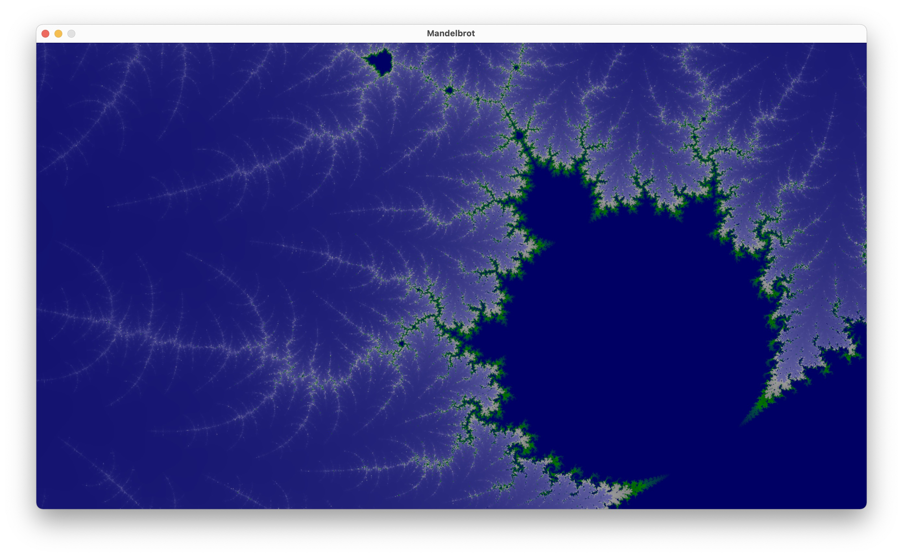
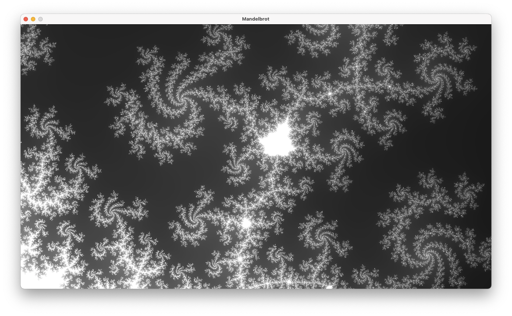

# Mandelbrot toy project

A toy project to generate Mandelbrot images using Rust.

For now, no parallel computation, no specific features. But it is possible to zoom to a
specific view by drawing a rectangle with the mouse.

## How to start

Tested under MacOS 11.4 with Rust 1.53.0.

    $ cargo run

Default compilation option make the rendering process a bit slow, you may also test the result using:

    $ cargo run --release

## Other samples

